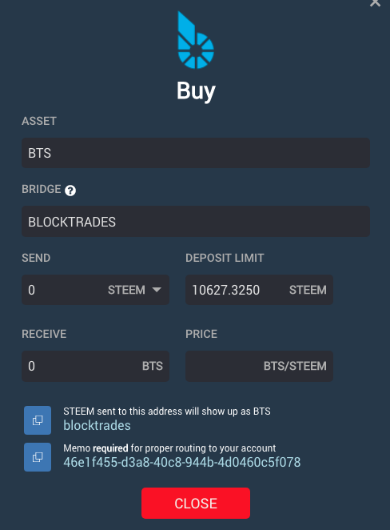
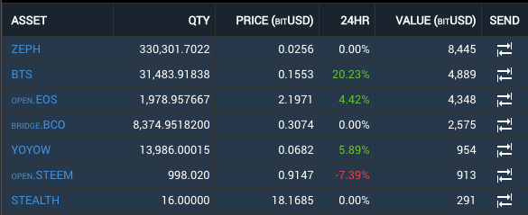

# Summary

In 171121 we present a framework for a new system of modals. In this release, we present the updated buy modal and begin the migration process to https://wallet.bitshares.org.

## Announcement
In an effort to address a security concern, we are migrating web users to https://wallet.bitshares.org from https://bitshares.org/wallet effective **immediately**.

### Bitshares Light Client (Downloaded Client)
This won't affect you. Just download the newest version as usual

### Cloud Wallet Users
All you need to do is change your bookmark to https://wallet.bitshares.org. You will need to reset all your preferred markets and for that we are sorry for the inconveience.

### Local Wallet Users
If you access your local wallet from https://bitshares.org/wallet, you will need to take a backup of your .bin file then import it into http://wallet.bitshares.org. We have minified the https://bitshares.org/wallet interface to make it easy to download your backup file.

# New and Improved

We've completely rewritten the Buy Modal. This is, in essence, an in-wallet API to the blocktrades.us functionality. It's a particularly easy way to purchase BTS and we would encourage tutorials to include procuedures for new users when explaining how to first acquire BTS. It removes the complications associated with explaining how to use the exchange.

We are now displaying a 24hr price change indicator in My Portfolio. The is a first attempt, so please help with any obvious bug reports related to it.

## Other notable improvements:
- Changed the faucet to the bitshares foundation fixed referral problems associated with the last release.
- Improved sort order in My Portfolio
- Added BTS as default asset in My Portfolio
- Standardized on Roboto Regular throughout **most** of the app
- Further improved notifcations related to current websocket

## Future plans include:
- Improved Header
- Redesigned Deposit / Withdrawal / Send Modals
- Tradingview integration
- Responsive Design

For a summary of bugs and features, check out the [Release Page](https://github.com/bitshares/bitshares-ui/releases/tag/2.0.171121).

For a detailed view of all closed issues in the Sprint, check out the closed [Milestone](https://github.com/bitshares/bitshares-ui/milestone/8?closed=1).

Downloads
Binary downloads for Linux, Windows and OS X are all located on this page in addition to the standard [Bitshares Downloads](https://bitshares.org/download) location.

Web
- https://wallet.bitshares.org

Proceeds from this post will be divided among @svk and me.