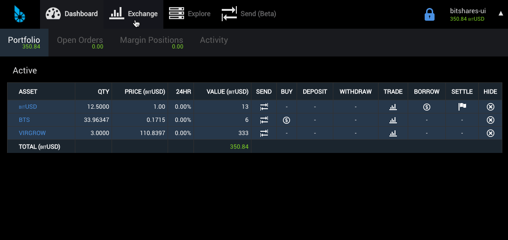
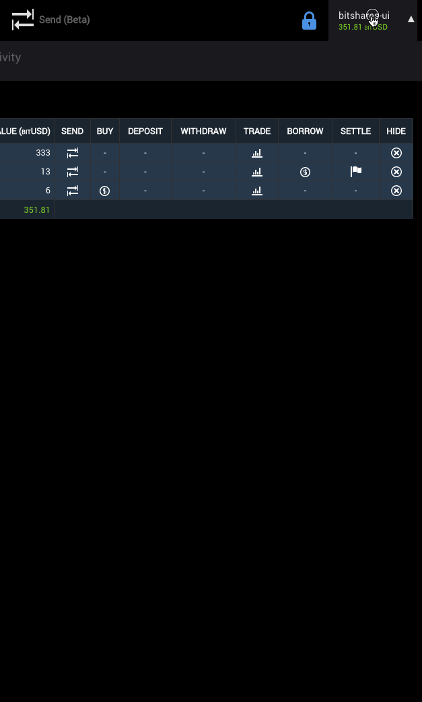
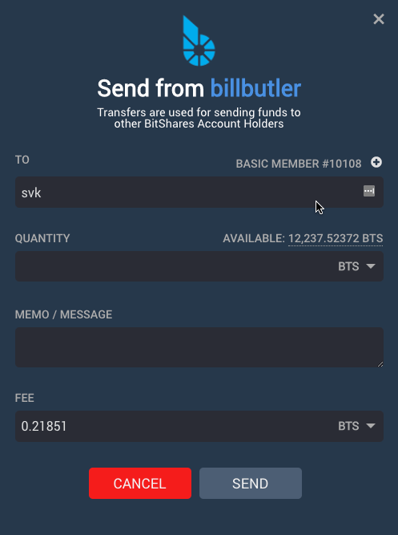
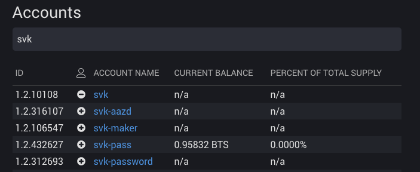
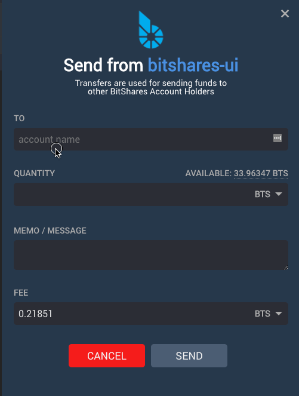

# Summary

In 171205 we present a completely new header and a new send modal in addition to a few bug fixes. We also part company with the left side panel. While some really liked the side panel, it contained elements that were rarely accessed by less technical users. It also encroached on valuable horizontal space needed for displaying columnar data.

# New

The new header features prominently displays icons for Dashboard, Exchange and Explore. We also added the new Send (beta) menu here so it would be visible.

The right dropdown menu includes a login/logout toggle at the top followed by:

- Send
- Deposit
- Withdraw
- Settings
- Help

Next, we have grouped the more administrative items including:

- Voting
- Assets
- Signed Messages
- Membership stats
- Vesting Balances
- Whitelist
- Permissions

Lastly, we have included a link to Accounts with Favorite (starred) accounts at the bottom.

We have also made some changes to the Follow pattern. There have bee several requests for an address book or contacts. Since the Follow feature is essentially another name for Contacts, we renamed it and also split out the Accounts are to:

- Accounts
- Contacts

An account is defined by any account where you hold the keys. A contact is defined by anypne you add to your contacts or anyone who you followed in the past. There are several ways to add contacts. These methods replace the "Follow" button previously present on the left panel.

- From the new Send Modal

    

- From Explore -> Accounts listing

    

The new Send Modal is ready. We still have some work to do on Proposed Transactions and for this reason, we left the existing Send intact and accessible from the right menu.

## Other notable improvements:
- It's now possible to cancel orders in bulk!
- Improved the red and green colors for the Light Theme
- Researched and planned TradingView implementation
- Matched Table headers and Fonts for otehr administrative areas
- Improved the local wallet detection to facilitate migration form bitshsres.org/wallet
- Fixed a small bug related to %change on Portfolio

## Future plans include:
- Redesigned Deposit / Withdrawal
- Tradingview integration
- Responsive Design

For a summary of bugs and features, check out the [Release Page](https://github.com/bitshares/bitshares-ui/releases/tag/2.0.171205).

For a detailed view of all closed issues in the Sprint, check out the closed [Milestone](https://github.com/bitshares/bitshares-ui/milestone/9?closed=1).

Downloads
Binary downloads for Linux, Windows and OS X are all located on this page in addition to the standard [Bitshares Downloads](https://bitshares.org/download) location.

Web
- https://wallet.bitshares.org

Proceeds from this post will be divided among @svk and me.