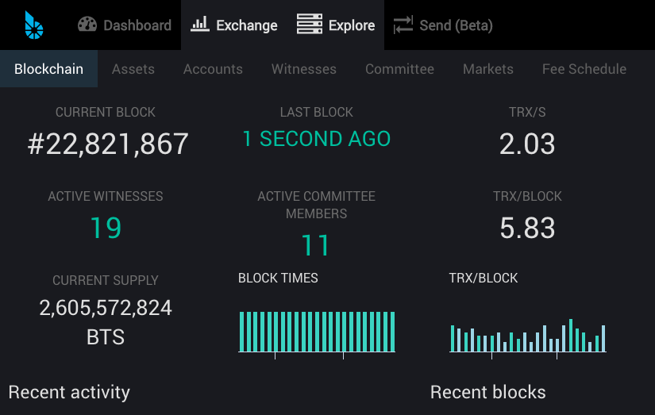
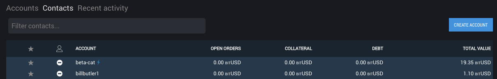

# Summary

In 171219 we spent time working towards deposit and withdraw modals but were unable to fully test. Additionally, we added a news area and fixed some bugs.

# New

We now have a news area within the wallet. Anything posted or resteemed by steem account bitshares.fdn will show up in this feed.

The Explore menu now follows the new hierachical top menu structure rather than presenting the large "cards".

We added back the Create Account option for local wallets which was mistakenly removed in the the previous version.

## Future plans include:
- Redesigned Deposit / Withdrawal
- Tradingview integration
- Responsive Design

For a summary of bugs and features, check out the [Release Page](https://github.com/bitshares/bitshares-ui/releases/tag/2.0.171219).

For a detailed view of all closed issues in the Sprint, check out the closed [Milestone](https://github.com/bitshares/bitshares-ui/milestone/11?closed=1).

Downloads
Binary downloads for Linux, Windows and OS X are all located on this page in addition to the standard [Bitshares Downloads](https://bitshares.org/download) location.

Web
- https://wallet.bitshares.org

Proceeds from this post will be divided among @svk and me.