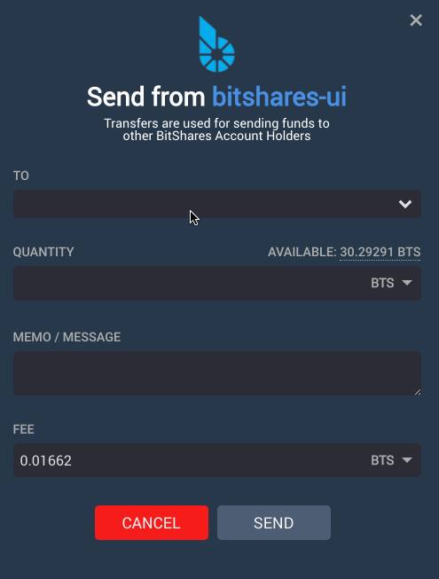
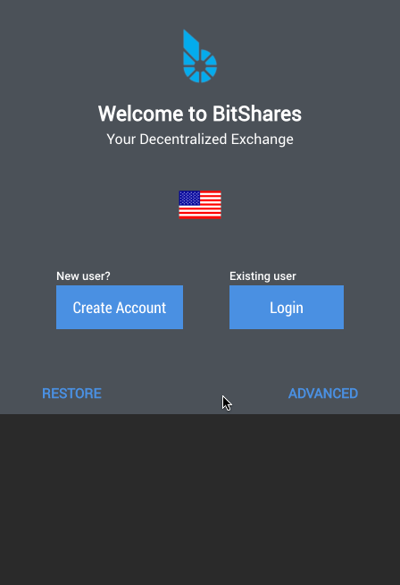
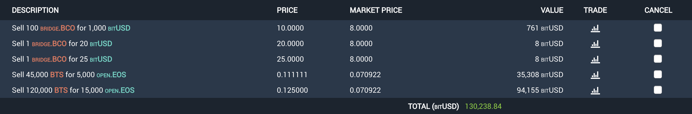

# Summary

In 180108 we release a beta version of the deposit modal and removed the beta label from the send modal. We also fixed a problem that kept users from downloading their old .bin file from https://bitshares.org/wallet. We resolved a number of bugs as well.

# New

Known accounts are now displayed in a typeahead and are displayed in green if they are in your contacts. This should help minimize sending to unknown users.

We awarded the bounty for the UDF wrapper which sets the stage for Tradingview integration. Really hoping to have tradingview in place during the next sprint or two.

We moved the language selection to the account registration page to make it easier for new users to become oriented.

We refactored open orders. It's still a work in progress, but we hope to be getting closer to a meaningful UI here.

## Other Improvements

- Increased the precision of the collateral slider to 1% from 5%
- Improved the Help area styling
- Created some UX for responsive design
- Fixed numerous bugs

## Future plans include:
- Redesigned Withdrawal
- Tradingview integration
- Responsive Design
- Friendlier multisig interface

For a summary of bugs and features, check out the [Release Page](hhttps://github.com/bitshares/bitshares-ui/releases/tag/2.0.180108).

For a detailed view of all closed issues in the Sprint, check out the closed [Milestone](https://github.com/bitshares/bitshares-ui/milestone/12?closed=1).

Downloads
Binary downloads for Linux, Windows and OS X are all located on this page in addition to the standard [Bitshares Downloads](https://bitshares.org/download) location.

Web
- https://wallet.bitshares.org

Proceeds from this post will be divided among @svk and me.