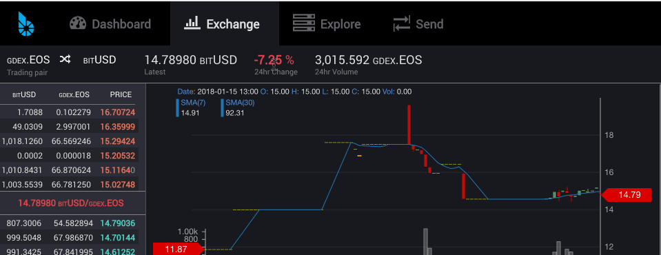

# Summary

In 180115 we release a new header on the Exchange, fixed a variety of issues associated with accounts prior to a user logging in, close the send modal after success, and made some small Deposit Modal tweaks

# New

The Exchange header now shows values more prominently and minimized the size of the labels. It also spans the entire width in an effort to reduce wrapping on narrow browsers. We have not addressed full responsivec design yet. This change is in preparation for the upcoming TradingView integration.

We separated the Accounts list from the Markets. These never really belonged together. While we expect some pushback on this, we expect to alleviate some concerns when we separate the account switcher menu from the navigation menu in the next release. Thanks for your patience on this.

The deposit modal was getting called from Portfolio even when certain exchanges had not yet been activated in the GUI. While we haven't actually added the new exchanges yet, we do plan to add BRIDGE and GDEX once we can communicate and test their API.

This was a very short Sprint since the the most recent one ended on 1/8. Still shooting for Withdraw and TradingView by the 180201 release.

## Future plans include:
- Redesigned Withdrawal
- Tradingview integration
- Responsive Design
- Friendlier multisig interface

For a summary of bugs and features, check out the [Release Page](hhttps://github.com/bitshares/bitshares-ui/releases/tag/2.0.180115).

For a detailed view of all closed issues in the Sprint, check out the closed [Milestone](https://github.com/bitshares/bitshares-ui/milestone/13?closed=1).

Downloads
Binary downloads for Linux, Windows and OS X are all located on this page in addition to the standard [Bitshares Downloads](https://bitshares.org/download) location.

Web
- https://wallet.bitshares.org

Proceeds from this post will be divided among @svk and me.